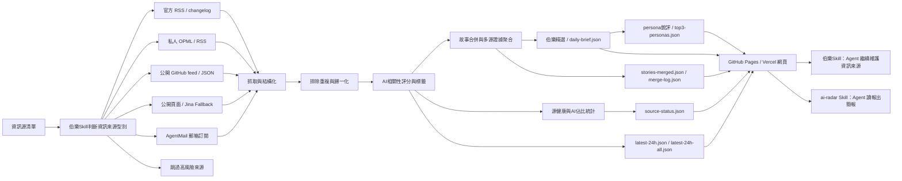

<div align="center">

# AI News Radar

## 24小時AI更新雷達｜三口味銳評

**先幫你從一堆資訊來源裡選出千里馬，再把分散訊息合併成故事線，最後用三種口味替你銳評每日頭條。**

[](https://github.com/LearnPrompt/ai-news-radar/stargazers)
[](https://news.learnprompt.pro)
[](https://github.com/LearnPrompt/ai-news-radar/actions/workflows/update-news.yml)
[](skills/radar/README.md)
[](LICENSE)

```bash
npx skills add LearnPrompt/ai-news-radar -s ai-radar -g
```

裝完對Agent說一句：`今天AI圈有什麼？`

**線上站** → [news.learnprompt.pro](https://news.learnprompt.pro)（資料來源/備用：[learnprompt.github.io/ai-news-radar](https://learnprompt.github.io/ai-news-radar/)）

[English](README.en.md) · [雷達Skill](skills/radar/README.md) · [伯樂Skill](skills/ai-news-radar/README.md) · [資訊源策略](docs/SOURCE_COVERAGE.md)

**更新說明**：v0.9 把介面收斂成單層資訊架構（欄目 tab × 精選/全量 × 時間軸），舊的三檢視截圖存檔於 [`/legacy/`](legacy/)，保留至 2026 年 8 月中旬。

</div>

---

## 30秒選邊上車

**① 讓Agent替你讀報** → 上面那行安裝命令，裝完一句話拿簡報，零API、零Key、零伺服器：


**② 直接看網頁** → 開啟 [news.learnprompt.pro](https://news.learnprompt.pro)。預設是手機版檢視，右上角「視角」開關能切到經典版（舊版桌面介面，路徑 `/classic/`），也可以直接用 `?view=mobile` / `?view=classic` / `?view=auto` 指定，兩個檢視讀同一份 `data/` 目錄資料。v0.9 起是單層資訊架構：頂部「全部/模型/產品/開發者/行業/論文/社群/自媒體」欄目 tab + 「精選/全量」全域性開關，主列表按時間倒序、按日分組，「當前熱點」榜不設固定條數單獨看當下最熱。每條精選卡片自帶一句話「推薦理由」；同一事件被多家資訊來源報道時會摺疊成「多源 N」標籤，點開看每家獨立標題。

**③ fork 擁有自己的篩子** → fork本倉庫，資訊來源換成你自己的 OPML，口味改 `personas/` 下的 markdown 檔案，資料長在你自己的 GitHub Pages 上。跳到[fork 指南](#fork-指南五步擁有自己的雷達)。

三層是一條路：讓Agent讀報 → 自己看報 → 自己辦報。

---

## 這是什麼

AI News Radar是一個自動更新的24小時AI更新雷達。它不只是把AI新聞抓回來，會先判斷資訊源質量，把同一個事件合併成故事線，再用三種口味的 persona 替你打分點評，最後用伯樂精選、AI標籤、源健康和AI佔比幫你判斷：

什麼資訊值得看，什麼值得深挖，什麼只是噪音。

普通使用者直接開啟網頁，看最近24小時AI、模型、開發者工具和技術生態更新。開發者可以fork這個倉庫，接入自己的OPML/RSS、公開feed、靜態頁面或AgentMail郵箱。Codex / Claude Code這類 Agent 可以使用專案內建的 **伯樂Skill**，繼續幫你判斷新的資訊源、維護抓取邏輯、部署 GitHub Pages。

這個專案永遠都不會是"又一個新聞網頁"。

它的核心邏輯是**伯樂Skill**，幫你從一堆資訊來源裡選出千里馬。哪些源值得長期追蹤，哪些源適合做成RSS/OPML，哪些源只能接付費的API，哪些源看起來更新很多但實際上跟你長期關注的方面比方AI只佔了裡面的5%不到。

先判斷清楚，再接入。

<table>
  <tr>
    <td width="30%" valign="top"></td>
    <td width="70%" valign="top"></td>
  </tr>
  <tr>
    <td align="center"><b>手機版</b>（所有裝置預設）</td>
    <td align="center"><b>經典版</b>（右上角「視角」開關，路徑 <code>/classic/</code>）</td>
  </tr>
</table>

## v0.9：單層資訊架構 + 標題增強

v0.8 的三檢視（伯樂精選 / AI訊號流 / 熱點榜）合併成了一層：一套欄目 tab + 一個精選/全量開關 + 一條時間軸。


- **雙檢視**：這套單層架構現在有兩套 UI 皮膚——根目錄 `index.html` 預設手機版，右上角「視角」開關可切到 `/classic/` 經典桌面版，也支援 `?view=mobile` / `?view=classic` / `?view=auto` 引數直接指定；兩套皮膚讀同一份 `data/`，選擇記在瀏覽器本地
- **欄目 tab**：全部/模型/產品/開發者/行業/論文/社群/自媒體，互斥單選
- **精選/全量全域性開關**：精選讀故事合併後的AI強相關高價值池，全量讀廣義AI相關的原始池（`latest-24h-all.json`，score >= 0.3），兩種模式共用同一套時間軸+日期分組模板
- **當前熱點**：不設固定條數，只要滿足多資訊來源熱度閾值就上榜，跟主列表分開單獨看
- **推薦理由真實化**：精選條目的一句話推薦理由由Pipeline側真實生成——對過了 AI 相關性篩選的條目抓取全文，交給 DeepSeek 寫一句「為什麼值得讀」（需要 `DEEPSEEK_API_KEY`）；沒有真實理由時前端直接隱藏這個區塊，不再用模板句撐場面
- **同一事件展開**：同一事件被 2 家以上資訊來源報道時，卡片上出現「多源 N」標籤，點開看每家獨立標題、來源和相對時間
- **標題增強**：標題過短或行話過多時，會拿原文上下文（自家抓取失敗時回退到 r.jina.ai）交給 LLM 改寫得更完整；配 `DEEPSEEK_API_KEY` 才生效，沒配就保留原標題，不影響其餘流程
- **源質量加固**：聚合源 zeli（Hacker News 24h 熱榜）取消整榜白名單放行，改成和其他聚合源一樣過同一套 AI 相關性打分；雙語標題翻譯新增校驗，拒答文案（比如「抱歉，我無法處理連結內容」）和退化輸出會被識別並回退到原文標題，不會把車軲轆話當標題顯示
- **資料同源開關**：給頁面 URL 加 `?data=<data目錄地址>` 可以讓前端讀取另一份 `data/`（比如驗證另一個分支或 PR 生成的資料），選擇會記在瀏覽器本地，方便多分支開發時來回切換
- **聚合源子來源分類**：聚合站點條目會按原始平臺再細分成 X / 公眾號 / HN / RSS 小標籤，緊跟在來源 chip 之後

## v0.8：三口味 persona 銳評

> 注：三口味的**網頁展示**已暫時下線歸檔（樣式待重設計，見 [docs/ROADMAP.md](docs/ROADMAP.md)）；資料Pipeline照常每日生成 persona 打分與點評，Skill 端日報不受影響。

同一條新聞，值不值得看取決於你是誰。v0.8 給日報裝上了可換的"口味"：

| 口味 | id | 視角 |
|------|----|----|
| **實用派**（預設） | `pragmatic` | 只關心對開發者/從業者今天有什麼用 |
| **毒舌評論員** | `cynic` | 拆穿營銷話術和炒作，譏諷但基於事實 |
| **較真黨** | `paper-police` | 只認論文/程式碼/benchmark 實證，對"即將推出"零容忍 |

- 每日精選20條按預設口味打分點評，命中當日 TOP3 的故事再由三個口味分別打分，一條新聞三個角度（點評資料在 `data/daily-brief.json` 與 `data/top3-personas.json`，Skill 日報直接引用）。
- 每個口味就是 `personas/` 目錄下的一個 markdown 檔案（frontmatter + system prompt）。想換口味，改一個檔案；想造新口味，照 [personas/README.md](personas/README.md) 的格式寫一個，PR 過來就能進內建列表。
- 上游配了 `DEEPSEEK_API_KEY` 才有 LLM 點評；不配也能跑全流程，自動降級成規則分，頁面和 Skill 都正常工作。

## 為什麼需要伯樂Skill

好新聞分散在各處，

官方部落格發一點，更新日誌發一點，X上有人提前爆料，聚合站又把同一個新聞轉來轉去。

我以為的自己在追前沿，實際每天都在重複三件事，

開啟幾十個頁面，肉眼+人腦過濾重複內容，猜哪條值得看。

讓伯樂Skill先替你完成第一輪判斷，**哪些資訊來源是千里馬，哪些是噪音**。

你可以隨意增加資訊源，還可以把一個資訊源納入輸入範圍，先讓它在單獨執行一週，再判斷要不要錄入。

AI News Radar從來都不是單純把資訊抓回來，

它更像是一條輕量的新聞pipeline，把來源判斷、抓取、排除重複、AI強相關過濾、persona銳評、資訊源健康狀態和靜態網頁釋出串起來，上線後核心流程不消耗模型額度。

## 能做什麼

### 給普通讀者

- 開啟線上頁面，用「全部/模型/產品/開發者/行業/論文/社群/自媒體」欄目 tab 快速定位關心的方向
- 用「精選/全量」全域性開關切換：精選看高價值故事線，需要補盲或檢索時切到全量的廣義AI相關原始池
- 主列表按時間倒序、按日分組，一屏看清楚今天/昨天分別更新了什麼；「當前熱點」榜單獨看當下最熱，不設固定條數
- 每條精選卡片帶一句話「推薦理由」（Pipeline側真實生成，沒有理由時這塊不顯示）
- 同一事件被多家資訊來源報道時，卡片上會出現「多源 N」標籤，點開看每家獨立標題，不用分別點進重複新聞
- 標題看不懂縮寫或行話時，配了 `DEEPSEEK_API_KEY` 的站點會用改寫後的完整標題
- 用具體來源和關鍵詞搜尋快速定位資訊
- 透過源健康和AI佔比判斷：哪些源是真有料，哪些源更新很多但AI含量低

### 給內容創作者

- 保留原始來源連結，方便繼續深挖、核對事實和做選題
- 同一個事件的多個來源摺疊進卡片的「多源 N」標籤，點開看每家獨立標題，減少重複閱讀也方便比對措辭差異
- 用AI標籤快速判斷一條訊息適合做圖文、短影片、還是工具實測
- 用多源重合、官方一手、單源觀察等訊號判斷選題可信度和優先順序
- 三口味點評天然是選題參考：實用派說有用、毒舌說有詐、較真黨說沒證據，分歧本身就是內容

### 給開發者和Agent

- 預設不需要 API Key、不需要登入態、不需要 LLM額度
- 支援官方 RSS/changelog、精選 AI 媒體 RSS、OPML/RSS、公開 GitHub feed/JSON、靜態頁面、AgentMail 等來源型別
- GitHub Actions自動生成 `data/*.json` 併發布到 GitHub Pages
- Codex / Claude Code / Hermes / OpenClaw 可以透過專案內建的伯樂Skill繼續維護資訊來源、抓取邏輯和頁面
- 本地/多分支開發可以用頁面 `?data=` 引數切換前端讀取的 `data/` 目錄，不用來回改程式碼或部署
- 高階來源可以透過 GitHub Secrets或本地環境變數接入，避免把 token、cookies、私有 OPML 和郵箱正文寫進倉庫

## 工作原理



AI News Radar學習了現代新聞學的技術，不是簡單堆資訊源，一次性放幾萬條資訊出來等於沒用，所以我選擇把新聞處理拆成穩定pipeline，抓取，排除重複，過濾，銳評，補充狀態，生成靜態站點。

在保證穩定性的同時追求輕量化，公開版不要求使用者配置LLM API Key，不依賴登入態，cookies，X API和郵箱。需要這些進階能力時，可以透過伯樂Skill用GitHub Secrets或本地環境變數接入。

## 資料產物

每次更新會生成一組靜態JSON檔案，頁面只讀取這些檔案，不需要後端服務。GitHub Pages 是資料的 canonical 源，Vercel 站只是同一份資料的另一個門面。

核心檔案包括：

- `data/daily-brief.json`：伯樂精選20條日報成品，v0.8 起含 persona 打分與點評欄位
- `data/top3-personas.json`：每日 TOP3 的三口味點評並排
- `data/latest-24h.json`：最近24小時AI強相關訊息
- `data/latest-24h-all.json`：最近24小時廣義AI相關訊息（score >= 0.3）
- `data/latest-24h-all-raw.json`：最近24小時零過濾全量訊息（dev-only，不接入前端UI）
- `data/source-status.json`：來源抓取狀態、成功率、站點覆蓋和源健康
- `data/stories-merged.json`：故事合併後的完整事件集合
- `data/merge-log.json`：故事合併過程和命中記錄，方便除錯與審計

如果 `daily-brief.json` 暫時不存在，頁面會回退到候選訊號列表；如果 `stories-merged.json` 存在，頁面會用完整故事池補齊後續故事線，避免只有少量精選故事被接入。

## Fork 指南：五步擁有自己的雷達

1. **Fork** [LearnPrompt/ai-news-radar](https://github.com/LearnPrompt/ai-news-radar)。
2. **開 Actions**：fork 後 GitHub 預設暫停 workflow，去 Actions 頁點一下啟用，`update-news.yml` 每30分鐘自動跑。
3. **（可選）配 `DEEPSEEK_API_KEY`**：Settings → Secrets and variables → Actions 加一個 secret，就能獲得 persona 銳評、標題增強、精選條目的真實推薦理由，以及更可靠的中文標題翻譯（拒答文案和退化輸出會自動回退原標題）。不配也全流程能跑，自動降級成規則分、原始標題加谷歌翻譯，推薦理由區塊直接不顯示。預設模型是 `deepseek-v4-flash`，需要換模型可以另配一個 Variable `DEEPSEEK_MODEL` 覆蓋。想控制每次執行改寫多少條標題，可以再配一個 `TITLE_ENHANCE_MAX_PER_RUN`（不配預設 30）。
4. **開 GitHub Pages**：Settings → Pages，選 master 分支根目錄。幾分鐘後你的雷達就活了。
5. **改 skill 一行**：把 `skills/radar/SKILL.md` 頂部的 `BASE_URL` 換成 `https://<你的使用者名稱>.github.io/ai-news-radar/data`，你的 Agent 從此讀你自己的資料。

想換資訊來源：把訂閱寫進 `feeds/follow.opml`（參考 `feeds/follow.example.opml`），或讓內建[伯樂Skill](skills/ai-news-radar/README.md)幫你判斷和錄入。想換口味：改 `personas/` 下的 markdown 檔案。翻譯不滿意：改根目錄 `translation-glossary.txt`（保護術語 + 修正規則，檔案內有格式說明），下次Pipeline執行自動生效。想要自己的域名：（可選）把倉庫 import 進 Vercel，倉庫裡的 `vercel.json` 已配好，零構建直接上線。想在驗證階段臨時看另一份資料（比如自己分支跑出來的 `data/`）：給頁面 URL 加 `?data=<data目錄地址>` 即可，不用改程式碼。

## 快速開始（本地執行）

普通使用者不用安裝，直接開啟線上頁面即可。

想fork改造新版本，可以本地執行：

```bash
git clone https://github.com/LearnPrompt/ai-news-radar.git
cd ai-news-radar
python3 -m venv .venv
source .venv/bin/activate
pip install -r requirements.txt
python scripts/update_news.py --output-dir data --window-hours 24
python -m http.server 8080
```

開啟：

```text
http://localhost:8080
```

如果你有自己的 OPML：

```bash
cp feeds/follow.example.opml feeds/follow.opml
# 把自己的訂閱源寫進 feeds/follow.opml，不提交這個檔案
python scripts/update_news.py --output-dir data --window-hours 24 --rss-opml feeds/follow.opml
```

## 給Agent看的教程

如果你想讓Codex / Claude Code / OpenClaw / Hermes幫你搭自己的版本，可以直接說：

```text
請使用伯樂Skill，先問我要資訊源清單，然後幫我判斷每個資訊來源該用RSS、公開feed、靜態頁面、JinaFallback、AgentMail郵箱還是跳過。目標是部署一個不需要伺服器、能用GitHub Actions自動更新的 AI 日報網站。不要把任何API Key、cookies、token、私有郵件內容寫入倉庫。
```

專案內建兩個 Skill，分工是「雷達管讀，伯樂管選」：

- `skills/radar/`：**ai-radar 雷達Skill**（消費側）——不用fork就能裝，自然語言問AI資訊，讀本站公開JSON出簡報
- `skills/ai-news-radar/`：**伯樂Skill**（維護側）——fork後用它錄入資訊來源、維護抓取邏輯、部署 GitHub Pages

新Agent接手驗收時，推薦先讀：

- `README.md`
- `README.en.md`
- `docs/GPT_HANDOFF.md`
- `docs/SOURCE_COVERAGE.md`
- `docs/V2_PRODUCT_BRIEF.md`

## GitHub 自動更新

`.github/workflows/update-news.yml` 已經配置好定時任務。

- 支援手動觸發 `workflow_dispatch`；需要忽略 TikHub 的正常付費源間隔時，顯式傳入 `force_tikhub=true`
- 預設每 30 分鐘執行一次：`*/30 * * * *`
- 自動生成並提交 `data/*.json`；Workflow使用 `git add data/`，避免新增 JSON 檔案因為白名單遺漏而停留在舊更新時間
- 如果設定 `DEEPSEEK_API_KEY`，會給每日精選打 persona 分、生成三口味 TOP3 點評、啟用標題增強、生成精選條目的真實推薦理由，並給出更可靠的中文翻譯（拒答文案和退化輸出會自動回退原標題）；不設定時自動降級為規則分、原始標題和谷歌翻譯，推薦理由區塊不顯示，核心流程照樣跑
- 預設 DeepSeek 模型是 `deepseek-v4-flash`（DeepSeek 官方將於 2026-07-24 棄用 `deepseek-chat` 別名），可以設定倉庫 Variable `DEEPSEEK_MODEL` 覆蓋
- 如果設定 `TITLE_ENHANCE_MAX_PER_RUN`，會限制每次執行最多改寫的標題條數；不設定預設 30
- 如果沒有設定 `FOLLOW_OPML_B64`，線上Workflow會自動使用公開示例 `feeds/follow.example.opml`，讓頁面展示 RSS/OPML 能力
- 如果設定 `FOLLOW_OPML_B64`，會優先自動解碼為私有 `feeds/follow.opml`
- 如果設定 `EMAIL_DIGEST_ENABLED=1`、`AGENTMAIL_API_KEY`、`AGENTMAIL_INBOX_ID`，會生成脫敏郵箱摘要
- 只有額外設定 `EMAIL_DIGEST_PUBLISH=1`，才會提交 `data/email-digest.json`
- 如果設定 `X_API_ENABLED=1`、`X_BEARER_TOKEN` 和預算變數，會在每日指定UTC視窗用官方X API抓取少量公開Post；預設關閉，且當前X API按返回資源計費
- 如果設定 `SOCIALDATA_ENABLED=1`、`SOCIALDATA_API_KEY` 和預算變數，會按 `SOCIALDATA_RUN_INTERVAL_HOURS`（預設12小時）透過 SocialData.tools 抓取少量公開 X/Twitter 搜尋結果；預設關閉，API Key 只應放在本地環境變數或 GitHub Secrets
- 如果設定 `TIKHUB_ENABLED=1`、`TIKHUB_API_KEY` 和預算變數，會按 `TIKHUB_RUN_INTERVAL_HOURS`（預設24小時）透過 TikHub 抓取少量抖音/小紅書關鍵詞搜尋結果；預設關閉，API Key 只應放在本地環境變數或 GitHub Secrets
- SocialData/TikHub 的拉取間隔會記錄在 `data/paid-source-state.json`，只儲存上次執行時間、結果數和錯誤名，不儲存 API Key；半小時Workflow跳過付費源時，舊條目仍保留在 `data/archive.json`，不會因為本輪未拉取就被清空

預設情況下，本專案不需要任何API Key就能跑核心流程。

線上頁面右上角顯示的"更新時間"來自 `data/latest-24h.json` 的 `generated_at`。如果頁面長時間停在舊時間，優先檢查 GitHub Actions 最近一次 `Update AI News Snapshot` 是否執行、是否有抓取錯誤、以及倉庫 Pages 是否部署到包含最新 `data/` 提交的分支。

高階源配置模板見 `examples/advanced-sources.env.example`，

預算說明見 `docs/research/advanced-source-free-tier-budget-2026-05-10.md`，

本地測試 TikHub 抓取時可以先小流量強制跑一次：

```bash
export TIKHUB_ENABLED=1
export TIKHUB_API_KEY='你的 TikHub API Key'
export TIKHUB_FORCE_RUN=1
export TIKHUB_QUERY='OpenAI,Claude,LLM,Agent,AI工具,人工智慧,AI'
export TIKHUB_PLATFORMS=douyin,xiaohongshu
export TIKHUB_MAX_RESULTS=10
export TIKHUB_DAILY_ITEM_LIMIT=10
python3 scripts/probe_tikhub.py --query 'OpenAI,Claude,LLM,Agent,AI工具,人工智慧,AI' --platforms douyin,xiaohongshu --max-results 10
python3 scripts/update_news.py --output-dir /tmp/ai-news-radar-tikhub --window-hours 24 --archive-days 3
python3 - <<'PY'
import json
from collections import Counter

status = json.load(open("/tmp/ai-news-radar-tikhub/source-status.json"))
latest = json.load(open("/tmp/ai-news-radar-tikhub/latest-24h-all.json"))
print("failed_sites =", status.get("failed_sites"))
print("empty_advanced_sources =", status.get("empty_advanced_sources"))
print("tikhub_status =", [s for s in status.get("sites", []) if str(s.get("site_id", "")).startswith("tikhub")])
counts = Counter(i.get("site_id") for i in latest.get("items_all_raw", []))
print("tikhub_24h_counts =", {k: counts[k] for k in sorted(counts) if str(k).startswith("tikhub")})
PY
```

遠端需要用當前 `master` 立即重跑 TikHub 時：

```bash
gh workflow run update-news.yml --ref master -f force_tikhub=true
```

自媒體欄目使用獨立的 7 天熱榜池，不改變其他欄目的 24 小時視窗。抖音和
小紅書搜尋都優先請求"一週內最多點贊"，再從響應中提取點贊、收藏、評論
和分享數。榜單分數由 85% 互動熱度和 15% 的 24 小時新鮮度加分組成；因此
真正的周內爆款優先，但剛開始起量的新內容仍有機會進入 Top 3。

小紅書按"先搜尋、後詳情"處理。搜尋階段使用 App V2 的最多點贊排序和
7 天篩選，並再次在本地校驗釋出時間：可信 API 時間優先；`0`、未來時間
或缺失時間會回退到 note id 的時間字首；仍無法確認或早於 7 天的筆記會被
跳過。透過時間門禁後，如需補齊圖文詳情，可按需呼叫官方詳情介面：

```python
import os
import requests

headers = {"Authorization": f"Bearer {os.environ['TIKHUB_API_KEY']}"}

search = requests.get(
    "https://api.tikhub.io/api/v1/xiaohongshu/app_v2/search_notes",
    headers=headers,
    params={
        "keyword": "AI",
        "page": 1,
        "sort_type": "popularity_descending",
        "note_type": "不限",
        "time_filter": "一週內",
    },
    timeout=30,
)
search.raise_for_status()

# Only request details after the search result passes the local 7-day time gate.
detail = requests.get(
    "https://api.tikhub.io/api/v1/xiaohongshu/app_v2/get_image_note_detail",
    headers=headers,
    params={"note_id": "透過時間校驗的 note_id"},
    timeout=30,
)
detail.raise_for_status()
print(detail.json())
```

影片筆記使用 `get_video_note_detail`。詳情介面用於補充作者、互動量、圖片、
標籤等結構化欄位，不替代搜尋階段的釋出時間判斷。

X API演示配置見 `docs/guides/x-api-demo-config.md`；

單賬號/單newsletter演示見 `docs/guides/rileybrown-alphasignal-demo.md`。

## 版本演進

| 版本 | 回答的問題 | 關鍵能力 |
|------|-----------|---------|
| v0.6 | 分散訊息怎麼變成事件？ | 故事線合併、AI標籤分數、源健康與AI佔比 |
| v0.7 | 故事多了，什麼最熱？ | 熱點檢視（多源聚簇×時間衰減）、社群分類、頭條式 Top3、寧缺毋濫門檻、評分回測工具、ai-radar 消費Skill |
| v0.8 | 同一條新聞，該聽誰的？ | 三口味 persona 銳評、TOP3 三味並排、口味即 markdown 檔案（可改可PR）、Vercel 公網站 |
| v0.9 | 三個檢視並存，怎麼看著像一條新聞線？ | 單層資訊架構（欄目 tab×精選全量×時間軸）、手機版/經典版雙檢視、推薦理由真實生成、標題增強、源質量加固、同一事件多源展開、資料同源切換、聚合源子來源分類 |

歷次改動見 [Releases](https://github.com/LearnPrompt/ai-news-radar/releases)。

## 致謝

- [AI HOT](https://aihot.virxact.com)：中文 AI 資訊聚合，資訊來源之一
- [superpowers](https://github.com/obra/superpowers)：skill 工程方法論來源
- [mattpocock/skills](https://github.com/mattpocock/skills)：skill 編寫方法論來源

## License

[MIT](LICENSE)

---

<div align="center">

**更多好用 Skill · More Skills** → [learnprompt.pro/skills](https://learnprompt.pro/skills/)

[魯班·Skill打磨](https://github.com/LearnPrompt/luban-skill) · [庖丁·博主蒸餾](https://github.com/LearnPrompt/paoding-skill) · [蔡倫·對話造紙](https://github.com/LearnPrompt/cailun-skill) · [阿福·LLM Todo](https://github.com/LearnPrompt/afu-llm-todo) · [愚公·Loop工程](https://github.com/LearnPrompt/loop-engineering) · [搭子·結對開發](https://github.com/LearnPrompt/partner-skill) · [AI雷達·零API資訊](https://github.com/LearnPrompt/ai-news-radar)

[淘金小鎮·ClawHub日榜](https://github.com/LearnPrompt/skillrush-town) · [Irasutoya·正文配圖](https://github.com/LearnPrompt/carl-irasutoya-illustrations) · [Humanize PPT·演講系統](https://github.com/LearnPrompt/humanize-ppt) · [CC Harness·六件套](https://github.com/LearnPrompt/cc-harness-skills) · [微信讀書教練](https://github.com/LearnPrompt/carl-weread) · [X Article釋出](https://github.com/LearnPrompt/x-article-publisher-skill)

<sub>**[LearnPrompt](https://github.com/LearnPrompt) 出品** · 公眾號「卡爾的AI沃茨」 · [X @aiwarts](https://x.com/aiwarts)</sub>

</div>
